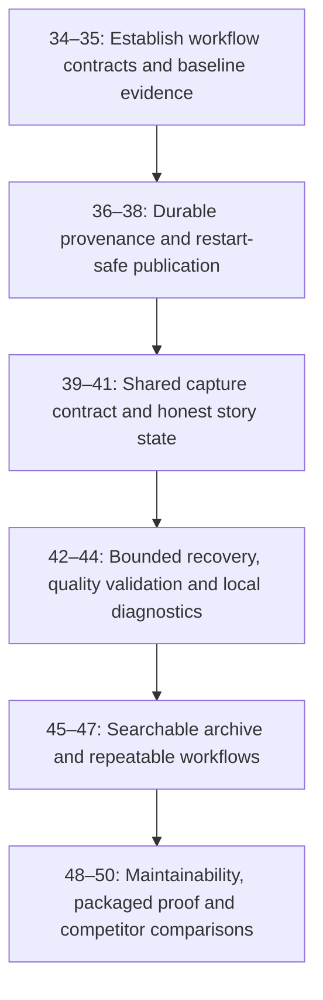

# JaneConverter Improvement Roadmap

## Product Direction & Core Posture

JaneConverter's primary promise is:

> *I have this media. I need it in another format.*

JaneConverter is a consumer-first media converter. The engine already supports local files and public URLs, bundles its production runtimes, validates outputs, and includes several targeted recovery paths. This roadmap strengthens those recovery paths so the app can handle unfamiliar media and changing social pages without turning every failure into a one-off patch.

This roadmap focuses on:
1. **Defensive hardening & regression protection** for the core conversion pipeline.
2. **Performance optimizations** (conditional instant remuxing, high-throughput extraction).
3. **Consumer workflow polish** (lightweight batch queue, context-aware controls).
4. **Adaptive social capture** (multi-strategy page reading, complete collection checks, and graceful recovery).
5. **The Mahoraga Conversion Engine** (bounded, policy-aware fallback methods for eligible conversion failures).
6. **Optional Facebook Graph API access** (an advanced, user-provided connection for eligible Page media).

---

## Architectural Principles & Boundaries

- **Pure Media Converter**: Takes media (local disk or web ingestion) and produces clean, playback-ready files in the user's requested container.
- **Not a Transcoder/Encoder Studio**: It is not HandBrake or Shutter Encoder. Quality settings exist because conversion requires choosing an output target, not for configuring matrix transforms or GOP structures.
- **Not a Download Manager**: It is not JDownloader 2. It avoids multi-threaded link crawling and CAPTCHA harvesting bloat.
- **Images are Valid Media**: Modern platforms deliver stills, artwork, and carousel posts alongside audio and video. Image conversion (JPG, PNG, WebP) is a first-class citizen.
- **Story Capture Isolation**: Social platforms deliberately alter DOM structures and CDN tokens. The story engine is treated as an adaptive experimental research module—it must never destabilize or delay core converter releases.
- **Intent-Preserving Recovery**: Retry only when a different method can meet the user's requested format and quality policy. Never silently change a target format, discard required streams or image frames, lower quality, or override cancellation to force a result.
- **Validated Recovery**: Run each attempt in temporary output, validate its media structure and requested properties, then publish it to the library only after it passes. Keep the input untouched.
- **Honest Quality Labels**: A lossless output encoding can preserve decoded pixels, but it cannot restore information already lost in a lossy source. If recovery changes format or other visible output properties, report the fallback and resulting file clearly.
- **Zero-Secret Privacy**: Never dump, log, or persist browser cookies, passwords, session databases, or signed tokens.

---

## Technical Engine Architecture

```
[ Input: URL / Local File / Browser Capture ]
                      │
        ┌─────────────┴─────────────┐
        ▼                           ▼
 [ Local Media ]             [ Web Ingestion ]
        │                           │
        │             ┌─────────────┴─────────────┐
        │             ▼                           ▼
        │     yt-dlp Extractor             Browser Bridge
        │     - Concurrent fragments (4x)  - Current-media direct
        │     - Smart codec sorting        - Adaptive "Mahoraga" Engine
        │     - Anti-throttling heuristics   (Surface → Ladder → Memory)
        │             │                           │
        └─────────────┼───────────────────────────┘
                      ▼
            FFmpeg High-Fidelity Engine
      ┌───────────────────────────────────────────┐
      │ 1. Conditional Stream-Copy Check:         │
      │    (-c copy ONLY if container compatible  │
      │     AND no filters/rescaling/norm active) │
      │ 2. Hardware Acceleration: (NVENC/AMF/QSV) │
      │ 3. Audio Precision: (SoX resampler,       │
      │    explicit 24/32-bit PCM, EBU R128)      │
      │ 4. Image Pipeline: (MJPEG, PNG-9, WebP)   │
      └───────────────────────────────────────────┘
                      ▼
          [ Output Validation & Probe ]
                      ▼
         [ Converted Library & Explorer ]
```

---

## Roadmap Phases

### Phase 0: Baseline & Defensive Protection
*Goal: Lock in current stability with formal matrix documentation and regression fixtures.*

#### Task 1: Define the supported conversion matrix
- Document all valid input $\rightarrow$ output permutations across Audio (`mp3`, `flac`, `wav`, `aac`, `ogg`, `m4a`, `opus`, `aiff`, `alac`, `ac3`, `mp2`, `wma`, `caf`, `au`), Video (`mp4`, `mkv`, `webm`, `mov`, `avi`, `flv`, `m4v`, `ts`, `m2ts`, `mpeg`, `mpg`, `3gp`, `wmv`, `asf`, `gif`), and Image (`jpg`, `jpeg`, `jfif`, `png`, `webp`, `bmp`, `tif`, `tiff`, `gif`, `ico`, `tga`, `ppm`, `pgm`, `pbm`).
- Treat filename detection as a UI convenience; actual input compatibility depends on the decoder available in the bundled FFmpeg or Pillow build.
- Formally document the exact boundary where zero-loss stream copying (`-c copy`) is permitted versus when transcoding is strictly mandatory.
- Define actionable, user-friendly error categories for unsupported conversions.

#### Task 2: Establish the conversion regression baseline
- Maintain local automated fixtures in `tests/` covering sample rates, video aspect ratios, still frames, artwork embedding, and corrupted inputs.
- Ensure all failure paths report clear, stage-specific diagnostics: `InputInvalid`, `ExtractorFailed`, `FFmpegProcessError`, `ValidationFailed`.
- Confirm all existing Python, Rust, and frontend test suites pass before engine refactors.

---

### Phase 1: Performance Optimization & Engine Refinement
*Goal: Accelerate extraction and conversion speed while preserving pristine audio/video fidelity.*

#### Task 3: Transparent FFmpeg & hardware diagnostics
- Maintain explicit runtime health indicators: detect bundled vs. system FFmpeg/FFprobe paths and versions.
- Run a harmless startup probe to discover active GPU encoders (NVIDIA NVENC, AMD AMF, Intel QSV, Linux VAAPI) with CPU fallback.

#### Task 4: High-throughput yt-dlp extraction enhancements
- **Concurrent Ingestion**: Enable `--concurrent-fragments 4` by default to bypass single-stream bandwidth throttling on supported CDNs.
- **Intelligent Format Sorting**: Prioritize cleanest codecs (`bv*[vcodec^=av01]+ba / bv*[vcodec^=vp9]+ba` for video; uncompressed Opus/M4A for audio).
- **Anti-Throttling Heuristics**: Utilize mobile client emulation (`player_client=android,web`) where appropriate to avoid aggressive web-client rate limits.

#### Task 5: High-efficiency, audiophile-grade FFmpeg pipelines
- **Conditional Stream-Copy (`-c copy`)**: Enable instant remuxing *only* when the target container accepts the existing codec AND no rescaling, normalization, filtering, or sample-rate conversions are requested.
- **SoX High-Precision Resampling**: Use `aresample=resampler=soxr:precision=28:cutoff=0.99` for audiophile sample rate changes without aliasing noise or phase distortion.
- **Bit-Depth Precision**: Enforce explicit PCM mapping (`pcm_s16le`, `pcm_s24le`, `pcm_f32le`) for lossless containers.
- **Output Probing**: Enforce post-conversion `ffprobe` verification (confirming readable headers, valid streams, non-zero bytes) before reporting success.

---

### Phase 2: Consumer Workflow Polish
*Goal: Refine everyday user ergonomics without bloating the interface.*

#### Task 6: Lightweight conversion queue
- Allow dragging and dropping a small batch of local files or URLs into a simple conversion queue.
- Apply a single unified preset across the batch while providing per-item progress, cancellation, and retry controls.
- Keep the queue strictly linear and consumer-oriented—avoiding download manager scraping bloat.

#### Task 7: Context-aware media controls & intent presets
- Automatically detect input media type (Audio, Video, Image) and dynamically display only relevant options (hide sample rate for images; hide resolution for audio).
- Provide goal-oriented presets (*"Studio Master (24-bit WAV)"*, *"Universal Compatibility (MP3/MP4)"*, *"High-Efficiency Web (WebP)"*) with technical knobs kept in an accessible Advanced drawer.

#### Task 8: Library completion & post-conversion actions
- Add instantaneous 1-click completion actions: **Open File**, **Open Folder**, **Copy Path**, and **Send to Converter** (for chaining).
- Ensure failed conversions never generate phantom entries in the Converted Library.

---

### Phase 3: The Adaptive "Mahoraga" Story & Browser Capture Engine
*Goal: Transform experimental story capture into an adaptive, multi-strategy orchestrator that overcomes obfuscated DOMs and ephemeral CDNs.*

*(Reference: [`docs/adaptive-story-capture-engine.md`](file:///d:/Documents/GitHub%20Repo/JaneConverter/docs/adaptive-story-capture-engine.md))*

#### Task 9: Story surface detection & candidate scoring
- Identify the active story modal using geometry (full-screen overlays, z-index, viewport-sized containers) and accessibility cues (`next`, `close`, `pause`, progress bars).
- Implement an evidence scoring matrix (+points for active playback, viewport fill, navigation proximity; -points for small avatar dimensions, repeated icons) to eliminate unrelated thumbnails.

#### Task 10: Multi-tier capture strategy ladder
Implement an ordered strategy ladder from least invasive to most approximate:
1. **Direct Media Response**: Validated media URL or response body.
2. **Page-Context Fetch**: Authenticated in-page fetch for approved hosts.
3. **Network Compatibility Capture**: Tab-scoped debugger stream interception.
4. **Rendered Image Capture**: Direct canvas or rendered image surface extraction.
5. **Cropped Visible-Tab Capture**: High-precision boundary crop of the active story rectangle.
6. **Rendered Video Capture**: MediaStream / MediaRecorder fallback for canvas-only video playback.

#### Task 11: Composite story fingerprinting & deduplication
- Generate perceptual composite hashes (surface geometry + media kind + dimensions + duration + visual hash + sequence index) to recognize the same story across rotating CDN tokens and prevent duplicate captures.

#### Task 12: Local adaptation memory & graceful recovery
- Cache successful capture strategies by hostname and layout signature (e.g., `site.com / layout-A -> preferred: page-context fetch`).
- Keep adaptation memory strictly structural: **never** store cookies, credentials, tokens, or private media.
- Ensure that if a strategy fails, the engine automatically steps down the ladder, updates its memory, and recovers without freezing the UI.

---

### Phase 4: Maintenance, Security & Release Hardening
*Goal: Ensure effortless long-term maintenance and verified release integrity.*

#### Task 13: User-initiated engine health checks
- Provide an in-app "Check Engine Health" button in Settings that displays current `yt-dlp` and `ffmpeg` versions.
- Allow user-confirmed, checksum-verified extractor updates with rollback capability, avoiding unpredictable silent background modifications.

#### Task 14: Packaged clean-machine smoke tests
- Automate CI verification ensuring packaged Windows installers and portable archives execute correctly on a fresh OS environment with all bundled runtimes (Python, FFmpeg, FFprobe, Node) fully functional.

---

## Explicit Non-Goals

- Do not turn JaneConverter into a download manager (no multi-threaded link crawlers, no CAPTCHA harvesting).
- Do not expose raw yt-dlp or FFmpeg CLI complexity to ordinary users.
- Do not turn JaneConverter into a video editor or transcoder matrix (HandBrake / Shutter Encoder).
- Do not allow story capture failures to block, freeze, or destabilize the core converter.
- Do not borrow or export browser cookies to disk by default.
- Do not retry blindly, exceed bounded time/resource budgets, or retry user cancellation and non-recoverable input/permission errors.
- Do not silently change an explicitly requested output format or quality policy. A lossless container cannot restore information already lost in a lossy source.
- Do not describe an alternate output as “guaranteed” until the decoder, encoder, and final output validator all accept it.
- Do not imply that a Meta access token unlocks every public post, personal profile, private album, or sign-in-gated item.

---

## Release Gates

A release is validated when:
- [ ] Core local conversion fixture matrix passes across all supported audio, video, and image targets.
- [ ] Conditional stream-copy (`-c copy`) executes instantly when safe and falls back to transcode when filters are active.
- [ ] Every completed conversion is verified via `ffprobe` before showing the completion indicator.
- [ ] The lightweight batch queue handles multi-item local conversions predictably.
- [ ] The Mahoraga story engine runs in its isolated sandbox without leaking errors into ordinary conversion.
- [ ] Packaged application smoke tests pass on a clean Windows machine with bundled runtimes.
- [ ] Facebook album completion, order, bounded rendition fallback, and no-partial-save behavior pass fixture coverage; representative public albums are manually checked.
- [ ] Mahoraga conversion recovery uses structured failure categories, bounded attempts, output-policy checks, and post-attempt validation.
- [ ] Recovery notifications identify any format or quality-policy change, and failed attempts never create library entries.
- [ ] The optional Facebook API path is offered only for verified supported media and never claims access beyond the connected token's permissions.

---

## Phase 5: Public Photo Collections

*Goal: Make one-link photo collection capture useful on the desktop sites where saving a whole public collection is cumbersome.*

#### Task 15: Pinterest board and section capture
- Detect public board, section, and Pin links in the existing Converter field.
- Scan rendered board Pins with bounded scrolling and validate image URLs against Pinterest's public CDN.
- Preserve the board title and save images under `Images/Pinterest`; refuse private or sign-in-gated content.

#### Task 16: Public post galleries
- Add public TikTok photo posts, Reddit gallery posts, and Tumblr photo posts to the same local manifest flow.
- Advance supported carousels and galleries, deduplicate image renditions, and validate each platform's CDN.
- Respect complete-manifest limits and report guest/sign-in failures without saving partial collections.

#### Task 17: User-facing routing and regression coverage
- Keep all supported collection URLs in the existing Converter workflow and show the platform name while capturing.
- Add URL/CDN/export tests and document supported collection types and access limits.
- Leave Snapchat Public Stories as a separate story-capture task until desktop guest access is verified.

---

## Phase 6: Facebook Album Capture Resilience
*Goal: Keep one-link public album capture reliable across Facebook page layout changes, image rendition changes, and transient download failures, while refusing to claim success for incomplete albums.*

### Task 18: Route Facebook links by the media they contain
- Distinguish photo collections from video posts before committing to the album scanner; a video post must reach the existing video extractor if no photo collection is present.
- Keep the existing one-link automatic multi-photo workflow for public collections.
- Use API access only as an optional path for content the app is authorized to access; do not make a developer token or App Review a prerequisite for ordinary public-link use.

### Task 19: Make page discovery react to changes and prove completion
- Observe relevant DOM changes and in-page navigation, with a bounded timer as a safety check rather than the primary polling loop.
- Record the evidence for completion: expected-count source, unique IDs, pending-batch acknowledgements, and a confirmed album end or viewer cycle.
- If count evidence conflicts, the page remains dynamic, or the end cannot be confirmed before the time limit, report an incomplete album and save nothing.

### Task 20: Make image rendition handling tolerate format variation
- Request formats the image pipeline supports; inspect response bytes and decoder results instead of trusting the `Content-Type` label alone.
- If the selected rendition cannot be decoded, try only bounded alternate renditions already observed on the Facebook page and allowed CDN hosts.
- Preserve per-image and total-size limits, redirect checks, image validation, selected output format, and all-or-nothing album publication.

### Task 21: Preserve order and recover failed downloads within the capture
- Preserve Facebook's observed album order separately from photo-ID deduplication.
- Keep validated files in the active temporary staging area when retrying a failed or expired rendition; refresh candidates from the guest page when needed.
- Never treat a staged or resumed collection as complete until every expected photo has passed validation; clean staging files after success, cancellation, or final failure.

### Task 22: Lock in Facebook behavior with replayable evidence
- Add sanitized page and response fixtures for photo grids, viewer navigation, count overlays, layout changes, login redirects, duplicate renditions, wrong MIME labels, expired URLs, and video-post routing.
- Add focused tests for ordering, bounded retries, output validation, timeout, cancellation, and no-partial-save behavior.
- Manually verify representative public desktop albums end to end; fixture success alone does not establish live Facebook compatibility.

### Checkpoint: Facebook Resilience
- [ ] Supported Facebook video posts route to video extraction; photo collections retain the one-link batch flow.
- [ ] The app only reports a complete album when its completion evidence agrees and all downloaded images validate.
- [ ] A recoverable rendition failure can use a bounded alternate candidate without exceeding limits or saving a partial collection.
- [ ] The image order matches the album's observed order.

---

## Phase 7: Mahoraga Engine for General Conversions
*Goal: Replace scattered, scenario-specific retries with a shared recovery coordinator that selects a safe next method from structured failure evidence and the user's output intent.*

The conversion engine already has individual fallbacks for stream-copy failure, unavailable hardware encoding, and cover-art embedding. Mahoraga should make these paths explicit and composable. It should not blindly retry every error or reinterpret “Preserve Quality” as permission to change the requested output.

### Mahoraga recovery contract
- **Classify first:** distinguish transient I/O, unsupported source/container, decoder failure, encoder failure, hardware unavailability, output validation failure, disk/resource failure, permission failure, and user cancellation.
- **Choose only eligible strategies:** each failure category maps to a bounded list of alternate methods; cancellation, invalid input, permission denial, missing output space, and policy conflicts stop without retry.
- **Honor the output contract:** every candidate declares its format, streams, quality behavior, metadata/frame handling, resource limits, and expected validation. A fallback that changes an explicit user choice is not automatic.
- **Validate and commit atomically:** stage attempts separately, validate the successful result, then add it to the library. Remove invalid attempts and never overwrite or delete the source.
- **Explain the recovery:** show that a fallback was used and name any output change, such as PNG instead of the source format. Keep detailed attempt reasons available in Console without exposing private URLs, signed query strings, credentials, or source-file contents.

For example, a photo that cannot be saved under the selected source-preserving path may be decoded and written as PNG only when that operation is supported and allowed by the selected quality policy. PNG can preserve the decoded pixels; it cannot recover detail lost in an already-compressed JPEG, and the format change should be disclosed. The same rule applies to audio and video: a “lossless” alternative must not be presented as byte-identical or as recovering quality absent from the input.

### Task 23: Define conversion intent, failure, and strategy contracts
- Represent the requested output intent explicitly: source-preserving, lossless, or target-format conversion, including required streams, frames, metadata, and quality constraints.
- Replace string-only failure interpretation at the recovery boundary with structured stage, category, retryability, and diagnostic data while retaining useful user-facing messages.
- Define which fallback changes are safe automatically and which require stopping for user choice; preserve current preset behavior unless a documented policy says otherwise.

### Task 24: Build the bounded recovery coordinator
- Register conversion methods as strategies with declared inputs, output properties, failure categories, cost/time bounds, and validators.
- Select the next eligible strategy from structured failure evidence; cap attempts and prevent repeating the same method with unchanged options.
- Consolidate existing stream-copy-to-transcode, GPU-to-CPU, and cover-art fallback behavior behind the coordinator without changing successful-path output.

### Task 25: Deliver the first Mahoraga vertical slice for images
- Handle decodable image responses whose filename or MIME label does not match the actual content by probing and decoding the bytes with supported decoders.
- Where the source-preserving path cannot produce a valid file, consider a lossless PNG output only if it satisfies the user's recovery policy; state the format change and retain the original input.
- Validate decoded image format, dimensions, animation/frame behavior where relevant, alpha/color handling, and final output before reporting success.

### Task 26: Add policy-safe audio recovery
- Route retryable audio failures through declared alternatives such as stream copy to re-encode, alternate compatible encoders, or CPU encoding where available.
- Preserve requested container, channels, sample rate, bit depth, normalization, and quality policy; stop when meeting them is not possible.
- Validate audio streams and relevant properties before accepting a fallback.

### Task 27: Add policy-safe video recovery
- Route retryable failures through declared alternatives such as remux to transcode and hardware to CPU encoding.
- Preserve requested container, resolution, frame rate, audio/video streams, and quality bounds; do not silently substitute a lower-quality encoder or discard a stream.
- Validate stream presence, dimensions, duration, and readable output before accepting a fallback.

### Task 28: Report and learn from bounded attempts
- Show a concise recovery message in the app and expose per-attempt method, result category, and final output properties in diagnostics.
- Keep adaptation local and structural: record which method succeeded for a failure category/tool capability, without storing media, source URLs, signed links, cookies, or credentials.
- Feed sanitized synthetic/replay cases back into regression coverage; do not use remote AI or silently rewrite recovery rules at runtime.

### Checkpoint: Mahoraga Image Recovery
- [ ] Eligible image failures recover through a validated, policy-approved alternative and make the final format clear.
- [ ] Invalid input, cancellation, permission errors, resource limits, and unsupported output requests stop without unsafe retries.
- [ ] No failed attempt appears as a completed library item, and original input files remain intact.

### Checkpoint: Mahoraga Audio and Video Recovery
- [ ] Existing fallbacks use a bounded coordinator and do not repeat identical attempts.
- [ ] Fallback output satisfies the requested format and media-property contract or the app stops with a clear explanation.
- [ ] Recovery attempts are diagnosable without storing private source data.

---

## Phase 8: Optional Facebook Graph API Access
*Goal: Let technically confident users connect their own Meta access token in Settings, use the API for Facebook Page media it actually exposes, and retain the existing one-link workflow for other supported links.*

The Graph API is permission-scoped. A user's developer app and token do not automatically grant access to arbitrary Facebook posts, private media, or every public album. This phase begins by proving that a supported endpoint returns the complete media set and usable renditions for representative Page posts. The API path is offered only where that proof holds.

### Task 29: Prove the useful API coverage before building the connector
- With a developer-owned test Page and approved permissions, verify which Page photo posts, albums, and videos the current Graph API can enumerate and whether it supplies every media item and a usable rendition.
- Document the token type, permissions, App Review requirements, pagination, expiry, and rate limits for each verified case. Treat unsupported post types as outside the API path.
- Compare completion and elapsed time against the existing guest capture on representative eligible posts; do not assume the API is faster or more reliable until measured.

### Task 30: Add an optional advanced connection in Settings
- Add a collapsed **Facebook API (Advanced)** section with an access-token field, **Check access**, an opt-in **Use API when available** control, connected Page/capability status, and **Remove access**.
- Keep the token out of ordinary settings JSON, browser storage, command-line arguments, error messages, and Console output. Store it in the OS credential store when supported; otherwise offer session-only use.
- Handle expired, revoked, or under-permissioned tokens with a clear status and a way to replace or remove the connection. Never ask for a Facebook password or Meta App Secret.

### Task 31: Put the setup instructions beside the connection controls
- Add a **How to get your own Facebook API access** disclosure or dialog in the same Settings section. It should contain the following copy, with live links to Meta's current documentation:

  1. Sign in to [Meta for Developers](https://developers.facebook.com/apps/) and create a Meta app for the Facebook Page use case you need.
  2. Open [Graph API Explorer](https://developers.facebook.com/tools/explorer/), select your app, and generate a User Access Token with the permissions Meta requires for the Page you manage.
  3. Follow Meta's [Page token guide](https://www.postman.com/meta/facebook/request/bqfxwbp/get-access-tokens-of-pages-you-manage) to obtain a Page Access Token for that Page. Access to other Pages or advanced permissions may require [App Review](https://developers.facebook.com/docs/graph-api/overview/access-levels/).
  4. Paste the Page Access Token into JaneConverter and select **Check access**. JaneConverter will show which supported Page media the token can read.

- Explain beside the steps: **“An access token is sensitive. Never paste your Meta App Secret or Facebook password. This connection only works for media allowed by your token and Meta's API.”**
- Link to Meta's current documentation rather than freezing a permission list in the app; the permission and review requirements can change.

### Task 32: Use the API only where the connected token is capable
- For an eligible Facebook Page link, try the API when the user enabled it and a connection check confirmed the required capability. Paginate the full media set and normalize it into the existing validated photo/video pipeline.
- Preserve image order, expected count, redirect/size checks, output-format behavior, cancellation, and no-partial-save guarantees. Do not bypass the local validation step because the data came from an API.
- If the API cannot access the post, is throttled, or returns an incomplete set, explain the reason and use the existing public guest path when that path is applicable. Never treat a permission error as authority to access private content.

### Task 33: Verify the connector and guide
- Cover connection, removal, missing permissions, token expiry, pagination, rate limiting, unsupported URLs, API-to-guest fallback, and redaction with focused tests.
- Walk through the in-app guide using a test developer app and supported Page, then verify an eligible multi-photo post end to end in the desktop app.
- Record measured speed and completion results; describe the API as faster or more reliable only for the media types where those results support it.

### Checkpoint: Optional Facebook API
- [ ] Settings explains how to obtain an access token, checks the token's actual supported capabilities, and allows removal without exposing the credential.
- [ ] An eligible Page collection completes through the API with every item validated and ordered; unsupported content remains on the established path.
- [ ] Token errors, rate limits, and incomplete API responses produce clear outcomes and never publish partial albums.

---

## Foundation and Workflow Advantage Extension — 2026-10-02

**Status:** Proposed implementation map, not implemented or runtime-verified by this planning pass. This section extends the existing roadmap in response to Jane's personal-toolkit direction. It takes priority for sequencing new work; earlier task checkmarks remain historical records, not fresh verification. Existing unfinished checks remain open. Optional Facebook API work is outside this critical path.

### Product purpose and practical promise

JaneConverter is Jane Cerys's local media toolkit: collect useful media from supported public pages or explicitly selected browser content, preserve context, convert when needed, and find or reuse the result later. The success measure is inconvenience removed from repeated personal tasks.

No scraper can guarantee permanent access to a changing external website. The engineering target is predictable failure containment: detect changes, retain valid work, choose bounded alternatives, explain uncertainty, and recover without corrupting files or destabilizing ordinary conversion. Unsupported, expired, inaccessible, or protected media must remain explicit outcomes.

### Specific workflows worth choosing JaneConverter for

| Workflow | Proposed reason to choose JaneConverter | Proof required |
| --- | --- | --- |
| Save a public photo post or carousel | One pasted link produces the correct ordered collection, with source context and clear completeness | Validate identity, order, count/end evidence, and every output; no irrelevant assets or silent omissions |
| Keep temporary game updates, starting with CDID | Selected stories become a dated, searchable local collection that remains useful after the story expires | Verify against the actual platform/viewer Jane uses; readable text, ordering, source context, capture method, and honest missing-item state |
| Turn mixed saved media into usable files | Local files and fetched media share presets, quality policy, history, and understandable recovery | Check actual requested output properties, no unwanted quality changes, no overwritten originals |
| Recover from interruptions | Closing, crashing, losing connectivity, or cancelling does not force unnecessary repetition | Interrupted work is reconciled on restart; validated items reused; missing items retried only with explicit user action |

The first priority set is Facebook and Instagram photo collections, the actual CDID story viewer once its platform is identified, and representative local audio/video/image conversions. TikTok expands after these gates pass. Other sites retain honest individual support status; no blanket guarantee follows from extractor presence.

### Source-backed starting point

Reviewed current local v2.2.7 source, existing plans, and test definitions; no new tests or live captures were run for this map.

- Conversion history records source and output settings in UI localStorage and keeps 200 rows (`desktop-ui/src/App.tsx`). It is not yet a durable catalog.
- The native fetched-media record lacks source-page URL and dedicated capture timestamp; reopening reconstructs entries from files (`desktop-ui/src-tauri/src/model.rs`, `access.rs`).
- Bounded conversion recovery, staged outputs, validation, GPU fallback, Unicode hardening, pause/abort, and the native single-job guard already exist. Extend these; do not replace them wholesale.
- Facebook completion evidence and replay fixtures exist (`facebook_capture.rs`, `desktop-ui/test/facebook-replay.test.js`). Reuse the test harness and migrate one adapter at a time.
- Story sequence remains experimental in the extension documentation. Its popup loop has a 45-second total budget and an 8-second no-new-item window; those cannot establish completion for all story sequences. Structural method preference expires after 14 days.
- Existing CI already exercises Python, frontend, Rust, and Browser Bridge suites. Add meaningful cases to those paths rather than building a second test system.
- The older market audit contains unsubstantiated superiority and resource-use claims. Reconcile public claims against measured evidence in the final phase.

### Dependency map



Each task is a deliverable slice with acceptance criteria in `tasks/todo.md`. Land and verify each slice before expanding. Do not perform a broad rewrite of the converter, all platforms, and the extension together.

### Foundation design

**1. Durable catalog with ordinary files.** Use a small versioned local SQLite catalog, preferably owned through one native service interface. Files remain usable outside JaneConverter. Store item/job IDs, safe source permalink, source site, observed title, capture time, optional publisher-provided time with its evidence, collection ID and order, capture method, byte hash, dimensions/duration, quality facts, original/derivative relations, current path, and completion evidence. Distinguish unknown values from verified values.

Persist safe user-facing provenance separately from structural adaptation preferences. Do not persist signed CDN links, access tokens, headers, or browser secrets. Preserve safe permalink parameters that establish identity; ambiguous credential-bearing URLs stay session-only. Store dates in UTC and display locally. Migration must back up existing history, tolerate malformed records and repeats, and never invent missing source links or original publication dates.

**2. Recoverable job and publication records.** Give jobs explicit states: queued, discovering, transferring, validating, ready-to-publish, complete, incomplete, needs-user-action, failed, paused, cancelled. Use one authoritative state owner with attempt IDs so late worker messages cannot reverse cancellation. Persist job/item checkpoints. File renames and database transactions are not jointly atomic: journal publication intent, publish without overwriting, commit the catalog record, and reconcile interruption at each boundary. Disk full, file locks, denied access, missing drives, and interrupted moves must leave understandable recoverable states.

Retain incomplete items in bounded private staging with visible cleanup controls. Preserve the default rule that an incomplete album is not published as complete. A separately chosen partial export may be added later, clearly labelled with known missing/unknown items; it is not an automatic fallback. Restart offers review/resume; it does not reopen tabs, sign in, or resume browsing silently.

**3. Common capture contract with site adapters.** A shared coordinator manages attempts, validation, time/byte limits, cancellation, and progress. Site adapters identify the intended post/viewer, discover candidates, navigate within that scope, refresh expiring references, and report completion evidence. Start by wrapping Facebook's existing path without changing its successful behavior; migrate Instagram separately.

Every adapter reports source identity, ordered candidates, available renditions, observations supporting completeness, and categorized failure. Shared machinery does not imply identical site navigation or one magic selector. Prefer stable semantics, media elements and explicit state changes, retaining tested site-specific fallbacks. Isolate parser failures from the conversion engine.

**4. Capability-aware strategy selection.** Try eligible direct extraction or guest-page discovery first. Offer an explicit handoff to Browser Bridge if the task requires the open browser. Within approved browser capture, prefer original readable bytes; use user-enabled tab-scoped network capture when applicable; use rendered image/video only when the chosen quality policy allows it. Higher-privilege modes are never silently enabled.

A rendered frame or playback recording is a different representation: label it, retain original bytes when available, and show resolution/audio/overlay limitations. For story patch notes, an optional rendered view can preserve text overlays absent from the underlying photo/video. Do not call a clean background-image download a complete patch-note capture if the update text is missing.

**5. Evidence-based collection status.** Separate complete, incomplete, and unknown. A quiet page or elapsed timeout proves only that nothing new was observed. Prefer consistent expected count plus verified order, or a trustworthy end marker/navigation cycle with no conflicting evidence. Record why a collection is complete and what is unknown. For stories without an exposed total or end marker, report “captured N observed items; total unknown.” Do not assume the source account has no additional stories.

**6. Bounded recovery.** Classify network interruption, rate limit, expiring media URL, changed layout, browser access requirement, unsupported media, validation failure, storage failure, and user cancellation. Transient network faults get limited backoff; respect server retry instructions. Refresh an expired rendition through the current approved page and revalidate item identity. Changed layouts use tested alternative discovery. Access restrictions prompt a clear action or stop. Cancellation, invalid input, and disk full never trigger endless retries.

Reacquire expiring URLs after restart instead of treating them as permanent checkpoints. Resume byte ranges only if the server and unchanged object identity support it; otherwise restart that item while reusing already validated collection members. Apply per-item, per-collection, per-host, and global resource budgets. Limited concurrency is introduced only after correctness and cancellation gates pass.

**7. Validation and identity.** Check signatures, decodability, media kind, dimensions, duration/streams where applicable, and requested conversion properties. A parser or ffprobe success alone does not prove a file is fully decodable: use decode checks in fixtures and proportionate sample/deep checks in production. Preserve alpha, animation, orientation, color information, audio, and subtitles when required by policy; reject or explain any unmet requirement.

Hash bytes for exact duplicate identity. Treat perceptual similarity as a suggestion or supporting evidence, not authority to delete or merge automatically. Two patch-note images with one changed line must remain distinct. Hash large media incrementally. Catalog matching must disclose when Spotify/Apple metadata was matched to a different source and retain the actual downloaded origin.

### Ordered delivery and release checkpoints

| Stage | Tasks | User-visible result | Gate |
| --- | --- | --- | --- |
| Baseline | 34–35 | Clear support boundaries and repeatable failure cases | Reconcile conflicting completion claims; record current packaged behavior |
| Durable foundation | 36–38 | Capture provenance survives restart; interrupted jobs are recoverable | No lost valid files, silent overwrite, or false completion in fault tests |
| Capture reliability | 39–41 | One-link collections and selected story sessions have reliable state | Correct identity/order; unknown completeness stays unknown |
| Recovery and quality | 42–44 | Retry only what needs retry; failures have useful actions | Bounded resource use and policy-preserving validated outputs |
| Personal workflow advantage | 45–47 | Find CDID notes later; repeat collection/conversion tasks easily | End-to-end personal use cases work with fewer manual steps |
| Maintenance and evidence | 48–50 | Compatibility fixes are safe and advantages demonstrable | Rollback, packaged tests and fair workflow comparison evidence |

### Measurement and test policy

Begin with a proposed 40-case synthetic/local replay set spanning supported collections, changed layouts, multilingual names, mixed media, expiring references, irrelevant thumbnails, near-identical patch notes, malformed media, and interruptions. Size the corpus by real failure diversity rather than test count. Add every reproduced defect to it.

Measure:
- Correct-item precision and collection completeness separately.
- False-success count, unwanted output changes, accidental overwrite, and lost validated work.
- Hands-on user actions, time to first usable file, total completion time, active versus paused time, and unnecessary redownload bytes.
- Manual browser handoffs, retry count, peak resource use, and maintenance effort per supported workflow.

Proposed release gates, not current results:
- All deterministic acceptance fixtures pass; zero false-complete claims, wrong-item acceptance, silent overwrite, or unwanted quality-policy changes in that corpus.
- Cancellation acknowledged within 2 seconds in the controlled harness and work stopped within each strategy's documented bounded shutdown limit.
- On at least 20 fault-injected restarts across transfer, validation, publication and catalog updates, retain each validated item and publish at most once.
- For each workflow promoted as verified, record at least 10 representative permitted live runs on two dates/build contexts when feasible, publishing the denominator, failures, access conditions, app/browser/adapter versions, and verification date. This is a minimum evidence sample, not a statistical uptime claim.
- First comparison goal: fewer user actions for the complete task without worse correctness or output properties. Set numerical speed targets only after a baseline.

Run offline fixtures on ordinary changes; live checks are explicitly initiated maintenance work using permitted examples, never a hidden recurring crawler or uploaded personal media. This plan creates no automation. External-site failure should downgrade the relevant support status and lead to a scoped fix; it should not block a critical unrelated local-converter fix. Changes that affect capture still must pass that path's own gate.

### Safe maintenance and usability

Use a small tested app release for compatibility fixes first. Later consider independently versioned capture components only if measured repair delays justify the packaging complexity. Such updates require verified origin, signatures, protocol compatibility, a user-visible choice, a smoke check, and rollback. Never fetch and execute arbitrary selector scripts or self-modifying code.

A first-run bridge check should explain installed/connected/ready states and guide one successful capture. Store distribution and platform signing are later improvements if other users need them; they are not prerequisites for Jane's personal use. Normal controls should remain “Save collection,” “Capture what I’m viewing,” “Preserve original,” “Convert,” “Retry missing,” and “Find source,” with engine internals in optional details.

Optional local OCR is particularly relevant to CDID patch-note images, but follows durable original capture. Search indexed text, show it alongside the original, and disclose uncertainty. Start with a measured script/language set; select a local dependency only after footprint, accuracy and licensing review. Do not turn OCR guesses into authoritative update text.

### Competitor evidence and fair comparison

Sources checked 2026-10-02:
- [yt-dlp](https://github.com/yt-dlp/yt-dlp): shared upstream extraction strength; feature breadth alone is not JaneConverter-specific.
- [gallery-dl](https://github.com/mikf/gallery-dl): configurable gallery/collection downloading; use as a specialist comparison where the content is supported.
- [Shutter Encoder](https://www.shutterencoder.com/): substantial conversion, production controls and web-video downloading; do not claim it lacks web extraction.
- [Video DownloadHelper changelog](https://v10.downloadhelper.net/changelog): v10 is self-contained and removed its general transcoding feature; compare current behavior, not old companion-app assumptions.

Run the same permitted source collection and requested output through JaneConverter and the relevant alternative, including their normal configuration. Record correctness, retained context, hands-on steps, cleanup, time, quality properties and current versions. “Not documented” or “not tested” is not “impossible.” Compare the whole chosen workflow, not every feature competitors offer. Publish a specific advantage only after the evidence supports it.

### Recommended starting slice

Tasks 34–38: baseline the current behavior, preserve capture provenance, migrate history safely, and make interrupted publication recoverable. These support every later feature and address the most concrete foundation gaps found in this audit. Next prove one Facebook collection path and the actual CDID story session before adding more platforms.

The CDID source platform/viewer, a few representative public examples, and desired languages for optional OCR are details to resolve during the relevant task. They do not block baseline, catalog, and restart-recovery work. This request authorizes planning only; implementation is not started by this document.
